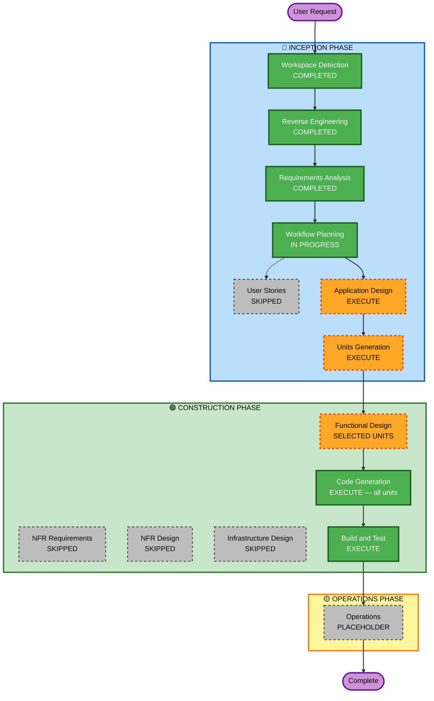

# Execution Plan

## Detailed Analysis Summary

### Transformation Scope
- **Type**: Multi-scope brownfield enhancement (architectural improvements + feature completions + code quality)
- **Primary Changes**: 10 architectural items, 5 high-priority features, 4 QoL improvements, bug fixes
- **Packages Affected**: `api/` (NestJS backend) and `client/` (React frontend)

### Change Impact Assessment
- **User-facing changes**: Yes — Standings page, Player splits, Player "Today", alert history, replay consistency, game page navigation
- **Structural changes**: Yes — Team branding pipeline, queue separation, caching layer additions
- **Data model changes**: Minor — `GameDto` field additions; no schema migrations required
- **API changes**: Additive only — new endpoints for standings and splits; no breaking changes to existing shape
- **NFR impact**: Positive — caching reduces upstream MLB API load; type fixes reduce runtime error surface

### Risk Assessment
- **Risk Level**: Low–Medium
- **Rollback Complexity**: Easy — changes are additive; existing behavior preserved
- **Testing Complexity**: Moderate — WebSocket pipeline changes (branding) and new endpoints need integration smoke testing

---

## Workflow Visualization

---

## Units of Work (Implementation Sequence)

All units are defined upfront. Implementation proceeds in dependency/priority order without approval gates between units. The four waves align with the user's stated priority ordering.

---

### Wave 1 — Architectural Foundation
*These units have no dependencies on new code and can be developed first. They address §5 highest-impact architectural items.*

#### Unit 1: Production Code Cleanup
**Priority**: §5 + §4.1 F4/F5 + §4.2 F9 + §6 HIGH bugs  
**Size**: Small (estimated 2–3 hrs)  
**Packages**: `api/`, `client/`  
**What**:
- Remove all production `console.log` calls: `GamePage.tsx` (timeline handler), `useRealtimeGame.ts` (socket lifecycle), `GamesService.ts:49` (request logging) — **fixes bugs #2, #3, #4**
- Gate `Debug` tab in `PlayerPage` behind `import.meta.env.DEV` — **fixes FR-FEAT-4**
- Extract `getReplayDelayMs()` to `client/src/utils/replayDelay.ts`; use it in both `GamePage.tsx` and `DailyGamesPage.tsx` — **fixes FR-FEAT-5**
- Add "← Back" button to `GamePage` — **fixes FR-QOL-2**
- Remove `footerUiEnabled = false` dead code block from `BoxScorePanel.tsx` — **fixes FR-QOL-4**
- Fix identical ternary in `realtime.gateway.ts:129` — **fixes bug #8**
- Fix `pnrimaryNumber` typo in `PlayerPage.tsx` — **fixes bug #1**
- On date change in `DailyGamesPage`, clear `selectedProviderGameId` — **fixes FR-QOL-3**

**Key files**:
- `client/src/pages/GamePage.tsx`
- `client/src/pages/DailyGamesPage.tsx`
- `client/src/pages/player/PlayerPage.tsx` *(note: currently `pages/PlayerPage.tsx`)*
- `client/src/pages/BoxScorePanel.tsx`
- `client/src/utils/replayDelay.ts` *(new)*
- `client/src/realtime/useRealtimeGame.ts`
- `api/src/games/games.service.ts`
- `api/src/realtime/realtime.gateway.ts`

---

#### Unit 2: Team Branding Unification
**Priority**: §5 A5.2 + §6 bug #5  
**Size**: Small–Medium (estimated 2–3 hrs)  
**Packages**: `api/`  
**What**:
- Inject `TeamsMetaService` into `PollerService`
- In `fetchGameMeta()`, resolve `homeTeamMeta` and `awayTeamMeta` via `TeamsMetaService.getByAbbr()` instead of `TEAM_BRANDING_BY_ID`
- Remove `TEAM_BRANDING_BY_ID` map entirely
- Add startup resilience to `TeamsMetaService.onModuleInit()`: catch ESPN API errors, log a warning, schedule a 60-second retry rather than throwing
- Add a `@Cron('0 6 * * *')` daily refresh

**Key files**:
- `api/src/poller/poller.service.ts`
- `api/src/teams/teams-meta.service.ts`
- `api/src/poller/poller.module.ts` *(add TeamsMetaModule import)*

---

#### Unit 3: API Response Caching
**Priority**: §5 A5.4 + A5.5  
**Size**: Medium (estimated 3–4 hrs)  
**Packages**: `api/`  
**What**:
- Add in-memory TTL cache to `PlayersService`: 24-hour TTL for biographical data (`getPlayer`), 5-minute TTL for season stats (`fetchSeasonStats`)
- Add in-memory TTL cache to `BoxScoreService`: 15-second TTL keyed by `providerGameId`
- Pattern: `Map<string, { data: T; expiresAt: number }>`, check `Date.now() < expiresAt` before fetching

**Key files**:
- `api/src/players/players.service.ts`
- `api/src/boxscore/boxscore.service.ts`

---

#### Unit 4: BullMQ Queue Separation
**Priority**: §5 A5.7  
**Size**: Medium (estimated 3 hrs)  
**Packages**: `api/`  
**What**:
- Create a dedicated `daily-poller` BullMQ queue in `InfrastructureModule`
- Move `daily` job type to the new queue and its own processor/worker
- Keep `game-poller` for per-game live polling only
- Set independent concurrency limits (e.g., `game-poller` concurrency=5, `daily-poller` concurrency=2)

**Key files**:
- `api/src/infrastructure/infrastructure.module.ts`
- `api/src/poller/poller.module.ts`
- `api/src/poller/poller.processor.ts` *(split into two processors)*
- `api/src/poller/poller.producer.ts`
- `api/src/domains/config/bullmq.config.ts`

---

### Wave 2 — Type Safety & WebSocket Config
*Addresses remaining architectural items. Depends on Wave 1 only for clean baseline.*

#### Unit 5: GameDto Type Safety + WebSocket URL Config
**Priority**: §5 A5.1 + A5.10  
**Size**: Medium (estimated 3–4 hrs)  
**Packages**: `api/`, `client/`  
**What**:
- Add missing fields to `GameDto`: `linescore` (typed object), `currentInning`, `isTopInning`, `halfInning`, `detailedState` — these are already sent by `MlbApiService.getScheduleByDate()` but not on the typed class
- Update `GamesController.listByDate()` return type to `GameViewDto[]` (already has `homeTeamMeta`/`awayTeamMeta`)
- Remove unsafe `as unknown as Record<string, unknown>` casts in `DailyGamesPage.tsx` — replace with typed field accesses
- Regenerate or manually update `@bitslinger21/baseball-realtime-client` SDK types
- Replace `const SOCKET_URL = "http://localhost:3000/realtime"` with `const SOCKET_URL = import.meta.env.VITE_SOCKET_URL ?? "http://localhost:3000/realtime"`
- Add `.env.local.example` documenting `VITE_SOCKET_URL`

**Key files**:
- `api/src/games/dtos/game.dto.ts`
- `api/src/games/dtos/game-view.dto.ts`
- `api/src/games/games.controller.ts`
- `client/src/realtime/useRealtimeGame.ts`
- `client/src/pages/DailyGamesPage.tsx`
- `.env.local.example` *(new)*

---

### Wave 3 — Bug Fixes (HIGH priority)
*Depends on bug-priority-assessment.md review (already presented). HIGH bugs are console.log removal — most are addressed in Unit 1. This unit handles any remaining confirmed high bugs post-review.*

#### Unit 6: Confirmed High-Priority Bug Fixes
**Priority**: §6 HIGH bugs  
**Size**: Small (estimated 1–2 hrs, likely absorbed by Unit 1)  
**Packages**: `api/`, `client/`  
**What**: Any high-priority bugs confirmed in the assessment not already covered by Unit 1. Review `bug-priority-assessment.md` and implement fixes. Current assessment shows bugs #2 and #3 (both console.log) are the only HIGH items — both are in Unit 1's scope.

**Note**: If Unit 1 already covers all HIGH bugs at implementation time, this unit is a verification pass only.

---

### Wave 4 — High-Priority Feature Completions (§4.1)
*These are full-stack features. Each is independent — no cross-unit dependencies within this wave.*

#### Unit 7: Standings Page
**Priority**: §4.1 F1  
**Size**: Medium–Large (estimated 5–7 hrs)  
**Packages**: `api/`, `client/`  
**What**:
- **Backend**: New `StandingsModule` with `StandingsController` (`GET /standings?season=YYYY`) and `StandingsService` calling MLB Stats API `/api/v1/standings?leagueId=103,104&season=YYYY&standingsTypes=regularSeason`. Map response to a typed `StandingsDto`.
- **Frontend**: Replace stub `StandingsPage` with a table view. Display AL/NL in two side-by-side division groups. Columns: Rank, Team (with logo from `awayTeamMeta` pattern), W, L, PCT, GB. Use existing team abbreviations and `TeamsMetaService` branding (via a new REST endpoint or by enriching in the standings controller).

**Key files**:
- `api/src/standings/standings.module.ts` *(new)*
- `api/src/standings/standings.controller.ts` *(new)*
- `api/src/standings/standings.service.ts` *(new)*
- `api/src/standings/dtos/standings.dto.ts` *(new)*
- `api/src/app.module.ts`
- `client/src/pages/StandingsPage.tsx`
- `client/src/api/baseballApiClient.ts`

---

#### Unit 8: Player "Today" Performance
**Priority**: §4.1 F2  
**Size**: Medium (estimated 4–5 hrs)  
**Packages**: `api/`, `client/`  
**What**:
- **Backend**: In `PlayersService.getBatterOverview()`, after fetching season stats, look up today's schedule for the player's current team (call `MlbApiService.getScheduleByDate(today)`). If a game is found (live or final today), fetch the live feed and extract the player's current/final batting stat line for the game (at-bats, hits, HR, RBI). Return a populated `BatterOverviewTodayDto`.
- **Frontend**: `BatterOverviewPanel` already renders `today.statLine` — no frontend changes needed beyond verifying the display handles the populated value correctly.

**Key files**:
- `api/src/players/players.service.ts`
- `api/src/players/dtos/batter-overview.dto.ts`

---

#### Unit 9: Player Splits Tab
**Priority**: §4.1 F5  
**Size**: Medium (estimated 4–5 hrs)  
**Packages**: `api/`, `client/`  
**What**:
- **Backend**: New endpoint `GET /players/:id/splits?season=YYYY` in `PlayersController`. `PlayersService.getPlayerSplits()` calls MLB Stats API with `stats=statSplits&group=hitting&sportId=1&season=YYYY`. Map the splits array to a typed `PlayerSplitsDto` covering vs LHP, vs RHP, home, away, day, night.
- **Frontend**: Replace "Splits tab next." stub in `PlayerPage` with a splits table. Show LHP/RHP rows and home/away rows with AVG/OBP/SLG columns.

**Key files**:
- `api/src/players/players.controller.ts`
- `api/src/players/players.service.ts`
- `api/src/players/dtos/player-splits.dto.ts` *(new)*
- `client/src/pages/PlayerPage.tsx`

---

### Wave 5 — Medium-Priority QoL (§4.2)
*These are UI improvements with no backend dependencies except Unit 10 which uses the existing alerts API.*

#### Unit 10: Alert History Panel
**Priority**: §4.2 F7  
**Size**: Medium (estimated 3–4 hrs)  
**Packages**: `client/` (uses existing `GET /alerts` endpoint)  
**What**:
- Add a collapsible "Alert History" section to `GamePage` below the alerts strip.
- On mount, fetch `GET /alerts?gameId=:providerGameId` from the existing `AlertsController`.
- Display alerts in a scrollable chronological list: timestamp, type chip (matching existing CSS), note text.
- Section collapses by default; toggle with a button.

**Key files**:
- `client/src/pages/GamePage.tsx`
- `client/src/components/AlertHistoryPanel.tsx` *(new)*
- `client/src/api/baseballApiClient.ts`

---

## Stage Decisions

### 🔵 INCEPTION PHASE
- [x] Workspace Detection — COMPLETED
- [x] Reverse Engineering — COMPLETED
- [x] Requirements Analysis — COMPLETED
- [ ] User Stories — **SKIP** (internal improvements, no user personas required)
- [ ] Workflow Planning — **EXECUTE** (in progress)
- [ ] Application Design — **EXECUTE** (new modules: Standings, splits endpoint, AlertHistory component)
- [ ] Units Generation — **EXECUTE** (10 units defined above)

### 🟢 CONSTRUCTION PHASE
- [ ] Functional Design — **EXECUTE** for Units 7–10 (new modules need detailed design); SKIP for Units 1–6 (well-defined changes to existing code)
- [ ] NFR Requirements — **SKIP** (no new NFR concerns; existing tech stack sufficient)
- [ ] NFR Design — **SKIP**
- [ ] Infrastructure Design — **SKIP** (no new infrastructure; BullMQ queue addition uses existing Redis)
- [ ] Code Generation — **EXECUTE** (all 10 units)
- [ ] Build and Test — **EXECUTE**

---

## Backlog (Do Not Lose Sight Of)

These items are tracked but deferred. They will surface as candidates for a follow-on plan.

| Item | Source | When to revisit |
|---|---|---|
| Health endpoint (`/health`) | §5 A5.8 | When deployment target changes from local-dev |
| NestJS Config Module | §5 A5.7 | When deployment target changes |
| Daily schedule caching | §5 A5.10 | When API rate limits become a concern |
| Multi-game view on Game page | §4.2 F6 | After Wave 4 is stable |
| Social features | PDF | Future major phase |
| At-Bat Card System | PDF | Future major phase |
| Advanced analytics (spray charts, heat maps) | PDF | Future major phase |
| StatsService persistence | §6 bug #10 | When observability becomes important |
| `upsertSnapshot()` type safety | §6 bug #9 | During next GamesService touch |
| Standings: live WebSocket updates | Future | After standings page ships |

---

## Success Criteria

- **Unit 1**: No `console.log` output during normal browser use; Debug tab hidden in non-dev builds; replay delay consistent between pages
- **Unit 2**: Play update wire objects carry team branding for all 30 teams; server starts cleanly even if ESPN API is unreachable
- **Unit 3**: Repeated player page loads within cache TTL produce no MLB API calls; repeated box score fetches within 15s produce no MLB API calls
- **Unit 4**: Daily schedule polls run independently of per-game live polls with no queue contention
- **Unit 5**: No unsafe casts in `DailyGamesPage.tsx`; all game card fields accessed via typed properties
- **Unit 6**: All HIGH bugs confirmed resolved
- **Unit 7**: Standings page loads and displays AL/NL division tables with team logos
- **Unit 8**: Player overview "Today" section shows actual game-day stat line when a game exists
- **Unit 9**: Splits tab shows vs-LHP/RHP and home/away splits for the current player
- **Unit 10**: Alert history is accessible from the game page and shows the full alert timeline

---

## Estimated Timeline

| Wave | Units | Estimate |
|---|---|---|
| Wave 1 — Arch Foundation | U1, U2, U3, U4 | ~10–13 hrs |
| Wave 2 — Type Safety | U5 | ~3–4 hrs |
| Wave 3 — Bug Fixes | U6 | ~1–2 hrs (mostly covered by U1) |
| Wave 4 — Features | U7, U8, U9 | ~13–17 hrs |
| Wave 5 — QoL | U10 | ~3–4 hrs |
| **Total** | **10 units** | **~30–40 hrs** |
