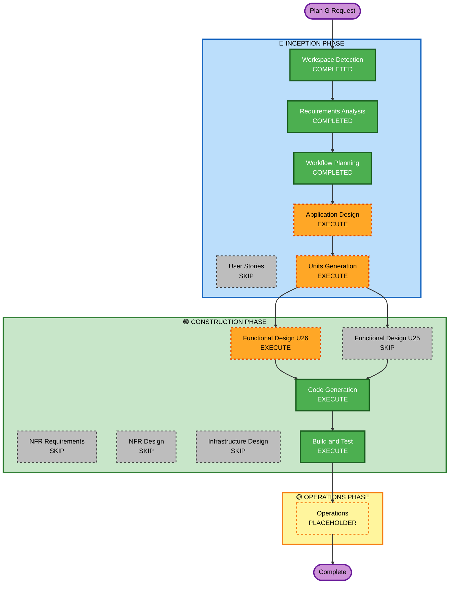

# Plan G Execution Plan — At-Bat Card System

## Detailed Analysis Summary

### Change Impact Assessment

| Area | Impact | Description |
|---|---|---|
| User-facing | YES | GamePage feed completely redesigned — pitch rows replaced with at-bat card blocks |
| Structural | YES | New AtBatCard component tree; GamePage feed state restructured |
| Data model | YES | PlayUpdateWire gains 4 new fields; SDK republish required |
| API | YES | WebSocket payload changes; SDK version bump |
| NFR | NO | No new performance, security, or scalability concerns |

### Component Relationships

| Component | Change Type | Reason |
|---|---|---|
| `api/src/poller/poller.service.ts` | Minor | Extract pX, pZ, szTop, szBottom from framePitch.pitchData |
| `api/src/realtime/realtime.types.ts` | Minor | Add 4 fields to PlayUpdateWire |
| `client/src/pages/GamePage.tsx` | Major | Feed restructure — at-bat block state management |
| `client/src/components/AtBatCard/` | New | Zone diagram + batter info + pitch log |
| SDK (baseball-realtime-client) | Minor | Version bump, new fields published |

### Risk Assessment

- **Risk Level**: Medium
- **Rollback Complexity**: Moderate — SDK publish is the only external side-effect; all changes are local
- **Testing Complexity**: Moderate — zone coordinate rendering + real-time accumulation logic

---

## Workflow Visualization



---

## Phases to Execute

### 🔵 INCEPTION PHASE

| Stage | Decision | Rationale |
|---|---|---|
| Workspace Detection | COMPLETED | Brownfield detected, prior state loaded |
| Reverse Engineering | COMPLETED | Prior artifacts current, no rerun needed |
| Requirements Analysis | COMPLETED | plan-g-requirements.md |
| User Stories | SKIP | Single developer, no acceptance criteria complexity, clear feature scope |
| Workflow Planning | COMPLETED (this doc) | |
| Application Design | **EXECUTE** | New AtBatCard component tree with sub-components; component boundaries and data flow need definition before code |
| Units Generation | **EXECUTE** | Two natural units with hard dependency: U25 (API + SDK) must complete before U26 (client) can consume new fields |

### 🟢 CONSTRUCTION PHASE

| Stage | Decision | Rationale |
|---|---|---|
| Functional Design — U25 | SKIP | Simple field extraction additions to existing poller; no new business logic |
| Functional Design — U26 | **EXECUTE** | Zone coordinate math, at-bat boundary detection, expand/collapse state — worth designing before coding |
| NFR Requirements | SKIP | No new NFR requirements beyond existing |
| NFR Design | SKIP | Same reason |
| Infrastructure Design | SKIP | No infrastructure changes |
| Code Generation | **EXECUTE** (both units) | Always runs |
| Build and Test | **EXECUTE** | Always runs |

---

## Package Change Sequence

```
Wave 1 — U25: API + SDK
  api/src/poller/poller.service.ts      (extract new pitch fields)
  api/src/realtime/realtime.types.ts    (add to PlayUpdateWire)
  → spec:check → spec:gen → client:build → client:publish
  → client: yarn add baseball-realtime-client@latest

Wave 2 — U26: Client UI  (depends on Wave 1 SDK)
  client/src/components/AtBatCard/      (new component tree)
  client/src/pages/GamePage.tsx         (feed restructure)
```

---

## Estimated Timeline

- **Total units**: 2 (U25, U26)
- **U25 — API enrichment**: Small (2–3 hrs)
- **U26 — AtBatCard + feed**: Large (6–9 hrs)
- **Total**: Medium-Large (8–12 hrs)

---

## Success Criteria

- `PlayUpdateWire` carries `pitchX`, `pitchZ`, `strikeZoneTop`, `strikeZoneBottom` on every pitch event
- AtBatCard renders zone diagram with color-coded numbered dots at correct coordinates
- Zone height scales dynamically from `strikeZoneTop`/`strikeZoneBottom`
- GamePage feed shows batter name rows with live at-bat card below; past at-bats collapse/expand on click
- No regression to box score, alerts, score header, or replay functionality
